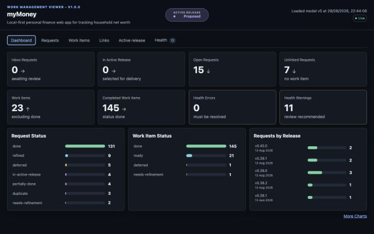

# Work Management Viewer

[](https://github.com/martynjsimpson/backlogViewer/actions/workflows/ci.yml)
[](https://github.com/martynjsimpson/backlogViewer/releases/latest)
[](LICENSE)

Work Management Viewer (`backlogViewer`) is a local dashboard and conformance checker for the
manifest-driven `Request → Work item → Active release → Done` model from the
[Work Management Claude Plugin](https://github.com/martynjsimpson/workManagementClaudePlugin).

The companion plugin creates and manages each project's work files. One central installation of
this viewer can inspect any compatible project without copying application code into that project.



The viewer never modifies project planning files. It reads `project.yml`, derives its configuration
from the manifest, and follows changes directly from disk. Health findings are diagnostic; repairs
and migrations remain the plugin's responsibility.

## Requirements

- Node.js 20 or newer
- A work-management manifest using `model_version: 3`, `model_version: 4`, or `model_version: 5`

## Quick start

Clone the viewer and install its dependency once:

```sh
git clone https://github.com/martynjsimpson/backlogViewer.git
cd backlogViewer
npm ci
```

Then choose either way of running it.

### Option 1: run `work-management-viewer` from a target project

From the `backlogViewer` repository, create a global command linked to this checkout:

```sh
npm link
```

`npm link` is the step that makes the `work-management-viewer` executable available outside the
viewer repository. The link uses the `bin` entry in `package.json` and continues to point at this
checkout, so pulling viewer updates does not require linking it again.

Now change to any target project containing a compatible work-management manifest and run the
command without a project argument:

```sh
cd /path/to/target-project
work-management-viewer
```

The viewer discovers the target project's manifest from the current directory. Confirm the link
from any directory with:

```sh
work-management-viewer --help
```

If the shell reports `command not found` after `npm link`, make sure npm's global executable
location is on `PATH`. Run `npm prefix -g` to find the global prefix; its `bin` directory contains
global commands on macOS and Linux, while the prefix itself contains them on Windows. Restart the
terminal after changing `PATH`. Moving or deleting the linked `backlogViewer` checkout will break
the command; run `npm link` again from its new location.

### Option 2: run from the viewer repository and pass the target path

Stay in (or return to) the `backlogViewer` repository and pass the target project explicitly:

```sh
cd /path/to/backlogViewer
npm start -- --project /path/to/target-project
```

The first `--` belongs to npm: it forwards the remaining arguments to the viewer. `--project`
accepts either a project directory or the exact path to its `project.yml`; relative paths resolve
from the `backlogViewer` directory in this example.

Whichever option you use, open `http://127.0.0.1:5177`.

Use a different port when needed:

```sh
work-management-viewer --port 5178
# or, from the viewer repository:
npm start -- --project /path/to/target-project --port 5178
```

## What it shows

- **Dashboard** — project-wide metrics and charts, kept independent of record filters.
- **Requests** — human-facing asks with filtered summary metrics, qualified search, and delivery links.
- **Work items** — YAML work records with filtered ready and blocked totals, plus dependencies, agents,
  and completion.
- **Links** — filtered link-health totals and request-to-work relationships, including missing and
  intentionally empty links.
- **Active release** — scope, status, decisions, agents, blockers, and verification information.
- **Health** — actionable errors, warnings, and recommendations for model conformance, with a
  filter-aware YAML export for handing the shown findings to an AI agent.
- **More Charts** — project-wide request, work-item, capability, priority, and delivered-release
  breakdowns.

Filter and navigation state is encoded in the URL, so filtered views can be bookmarked and browser
history behaves normally. Search accepts text and qualified terms such as `status:blocked`,
`type:spike`, `agent:frontend-developer`, `capability:imports`, and `source:v1.2.3`.

The Health export contains only the findings selected by the current severity and code filters. It
includes the complete, untruncated guidance plus project, source-file, filter, and model-generation
metadata so another agent can identify and repair the affected records.

Dashboard totals and charts always represent the whole project. Selecting a chart row opens the
relevant filtered record view, where the filter bar and its three summary metrics work together.

## Live updates

The viewer watches the selected project and updates automatically as agents change its files. A
small header indicator shows whether updates are live, being applied, paused, reconnecting, or
using periodic fallback checks. Click the indicator to pause or resume live updates; resuming also
checks immediately for any changes made while updates were paused.

Updates replace only the in-memory model, not the page. The current tab, URL-backed filters, search,
scroll position, keyboard focus, and open details modal are retained. Rapid file events are grouped
into one refresh, overlapping refreshes are coalesced, and unchanged models are not redrawn. If an
agent is midway through writing invalid YAML or Markdown, the last valid model remains visible and
the viewer recovers on the next valid change.

Filesystem watching is supplemented by a low-frequency check and reconnects automatically after a
server restart. Hidden browser tabs disconnect to avoid unnecessary work and check immediately when
they become visible again.

## Manifest discovery

Without `--project`, discovery starts at the current working directory and walks upward. At each
level it checks, in order:

1. `docs/work/project.yml`
2. `.claude/work/project.yml`
3. `project.yml` when `requests.md` and `backlog.yml` are beside it

Discovery stops at the Git repository root when one exists. No conventional work-file path is
used after discovery: `paths.work`, `paths.spikes`, `paths.changelog`, both ID prefixes, taxonomy,
and the agent roster all come from the manifest.

In a version 4 or 5 manifest, `scope.root` selects a monorepo member's project boundary. Relative
manifest paths resolve from that project root; paths beginning with `/` resolve from the VCS root,
matching the plugin's model. Project metric history and filesystem watching remain scoped to the
selected member rather than its siblings.

The viewer supports manifest schema versions 3, 4, and 5. Other, missing, or shape-incompatible
manifests produce a clear startup error. They are never auto-migrated.

## Metric history

Metric snapshots are stored outside both the installed package and the project. The location is
platform-specific and each canonical project root hashes to a separate state file. One project's
history therefore cannot affect another's, even when their names match:

- macOS: `~/Library/Application Support/work-management-viewer/`
- Linux: `$XDG_STATE_HOME/work-management-viewer/` or `~/.local/state/work-management-viewer/`
- Windows: `%LOCALAPPDATA%/work-management-viewer/`

Set `WORK_MANAGEMENT_VIEWER_STATE_DIR` to override the location, which is useful for tests and
temporary environments.

Only project planning files are read-only: the viewer writes this small local history file so it
can show changes since the previous snapshot. It retains at most 180 changed snapshots per project.

## Security model

This is a single-user local development tool, not a hosted service:

- The HTTP server binds only to `127.0.0.1` and rejects non-local Host headers.
- Its HTTP surface accepts only `GET` and `HEAD`, and it applies a restrictive browser security
  policy. The live-update stream is same-origin and read-only. The only disk write is the
  metric-history file described above.
- Project content is inserted as text rather than interpreted as HTML, and Markdown support is a
  deliberately small safe subset.
- The application makes no outbound network requests at runtime and has no telemetry.

There is intentionally no authentication. Do not expose the server through a reverse proxy, port
forward, container-published interface, or public network. Only select projects you trust: the
manifest controls which local work files the viewer reads.

## Architecture

The application deliberately stays small: a Node.js HTTP server and parser layer feed a vanilla
HTML/CSS/JavaScript client. There is no build step, database, frontend framework, or runtime
dependency beyond the YAML parser.

## Development

```sh
npm ci
npm run check
node server.js --project test/fixtures/custom-project/project.yml --port 5178
```

`npm run check` validates the server and browser scripts, then runs the `node:test` suite. Tests
cover manifest discovery and compatibility, parsers, bidirectional links, Health guidance, live
change events, local HTTP protections, and per-project metric-history isolation.

## Compatibility contract

This codebase was last verified against
[Work Management Claude Plugin v1.5.0](https://github.com/martynjsimpson/workManagementClaudePlugin/releases/tag/v1.5.0)
and its `model_version: 5` manifest on 28 August 2026. `SUPPORTED_MODEL_VERSIONS` lives in
`src/constants.js`; the viewer deliberately retains versions 3 and 4 compatibility and fails
closed on any unlisted version rather than rendering plausible but incorrect data.

Before every viewer release:

1. Check the plugin's releases and `CHANGELOG.md` for everything newer than the version recorded
   above.
2. Compare the current plugin `templates/project.yml` and model documentation with the viewer's
   manifest shape checks, path resolution, parsers, Health rules, and test fixtures.
3. Implement any compatibility changes and run `npm run check`. Exercise a real project when the
   data model or rendering contract changed.
4. Update the verified plugin version and date above, even when the audit requires no code change.

## License

MIT. See [LICENSE](LICENSE).
